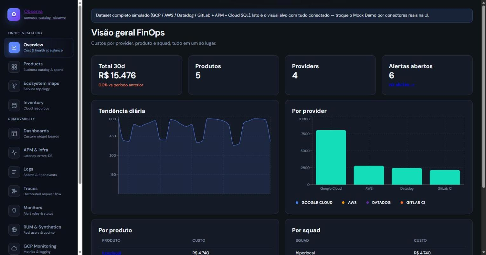
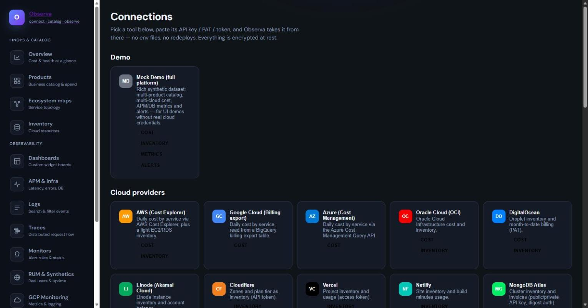
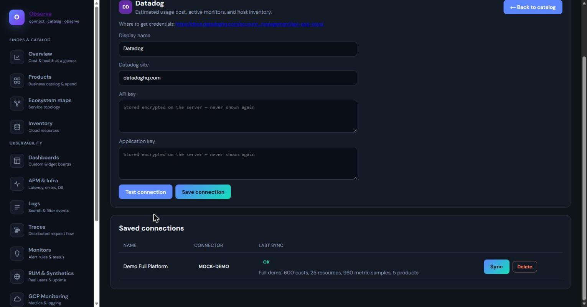
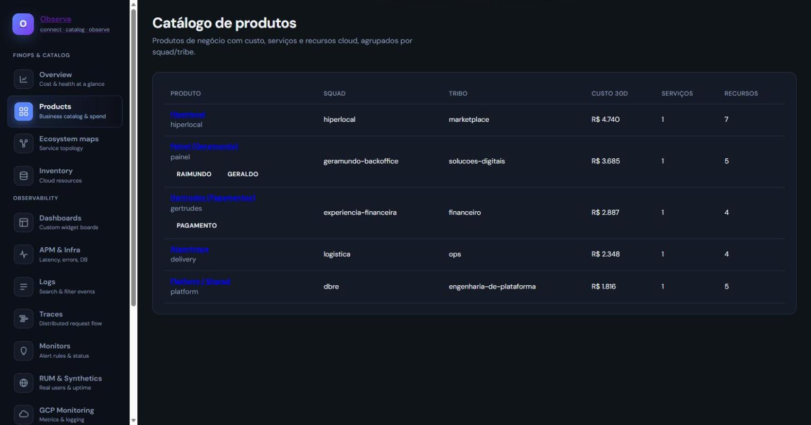
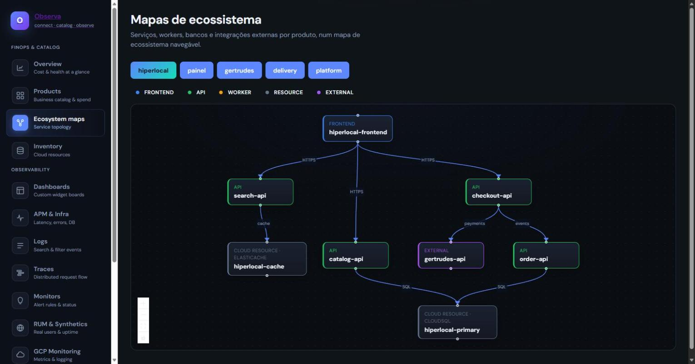
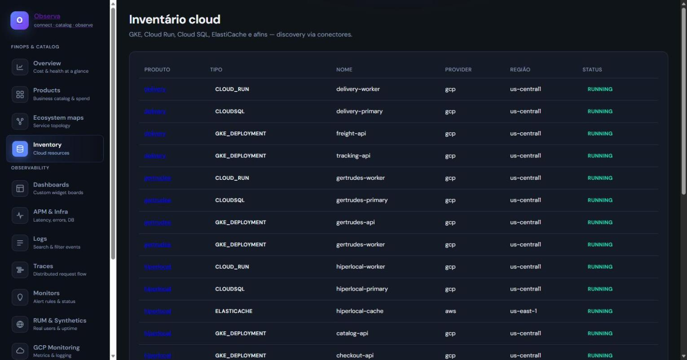
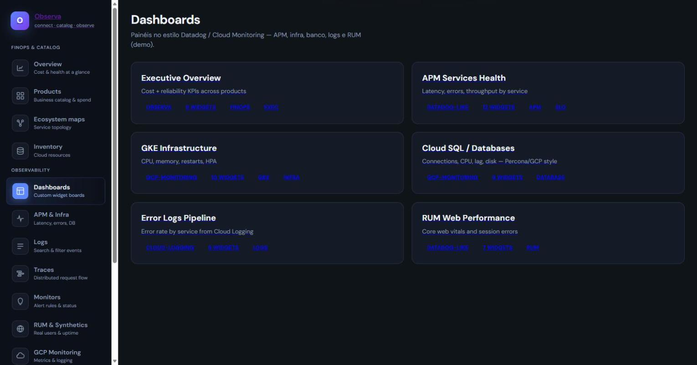
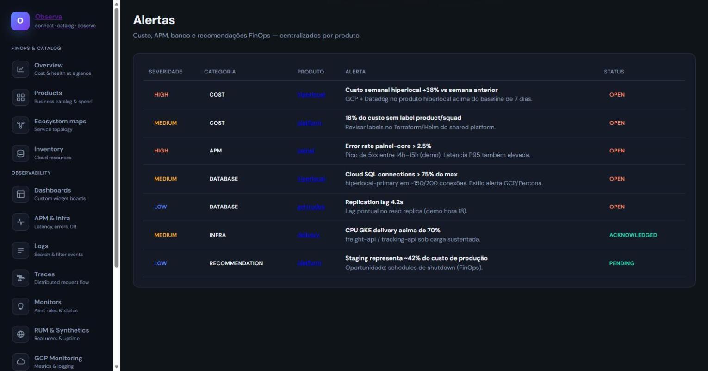

# Observa

Open-source platform to **connect clouds**, **catalog products**, and see **cost + health** — via pluggable connectors, configured entirely in the UI.

> *Connect clouds. Catalog products. See cost and health.*

Observa is self-hosted / local-first and multi-cloud by design — bring your own credentials for any supported cloud, observability tool, or on-premise system, and Observa builds the cost + health view for you. No env files, no redeploys: every data source is added, tested, and synced from the **Connections** screen.



## Contents

- [Quick start (Docker)](#quick-start-docker)
- [Quick start (local dev)](#quick-start-local-dev-no-docker)
- [User guide](#user-guide) — walkthrough of every screen
  - [Connections — add a data source](#1-connections--add-a-data-source)
  - [Overview](#2-overview)
  - [Products](#3-products)
  - [Ecosystem maps](#4-ecosystem-maps)
  - [Inventory](#5-inventory)
  - [Dashboards](#6-dashboards)
  - [Alerts](#7-alerts)
  - [Observability pages](#8-observability-pages-apm-logs-traces-monitors-rum-gcp)
  - [Authentication](#9-authentication)
- [Supported connectors](#supported-connectors)
- [Governance, CLI and mobile](#governance-cli-and-mobile)
- [Budget guardrails](docs/BUDGET_GUARDRAILS.md)
- [Companies and tenancies](docs/MULTITENANCY.md)
- [Portable deployment](docs/DEPLOYMENT.md)
- [Privacy and isolation](docs/PRIVACY_SECURITY.md)
- [Log diagnosis and remediation](docs/REMEDIATION.md)
- [Mapa Vivo and contextual assistant](docs/MAPA_VIVO.md)
- [Web design system](docs/UI_DESIGN_SYSTEM.md)
- [Complete testing guide](docs/TESTING_GUIDE.md)
- [Architecture](#architecture)
- [Principles](#principles)
- [License](#license)

## Quick start (Docker)

```bash
cp .env.example .env
docker compose up -d --build
```

- Web: http://localhost:3000
- API: http://localhost:8080
- API docs (OpenAPI/Swagger): http://localhost:8080/docs

No credentials or secrets required to boot — the encryption key for connector
credentials, and a random **API key**, are both generated on first run and
persisted in a Docker volume (`data/secrets.key`, `data/api_key`). The API
key is required on every `/api` request (until OIDC login is wired, this is
what stands between the connections you add and anyone who can reach the
API over the network) — grab it from `docker compose logs api` on first
boot, or `cat data/api_key`, and paste it into the web app when prompted.

## Quick start (local dev, no Docker)

```bash
./scripts/dev-local.sh
```

That script creates the Python venv, installs the API + connector SDK, installs the web app's `npm` dependencies, and starts both the same way as above, with hot reload.

Default auth mode is **local** (no login screen) until you turn on SSO in **Settings → Authentication**.

First run:

1. Open **Connections** → pick **Mock Demo** → *Save connection* → *Sync*.
2. Open **Overview** / **Products** to see the sample cost + catalog data light up.
3. When you're ready, add your real connectors (below) and, later, SSO.

Observa starts with a backward-compatible default company and tenancy. Create additional
companies and isolated production/sandbox/business-unit tenancies under
**Platform → Organizations**, then select the active context in the sidebar.

## User guide

### 1. Connections — add a data source

**Connections** is the only screen you need to plug in a real cloud, tool, or on-premise system. It's a catalog: pick a tile, paste a credential, done.



- Tools are grouped by category — **Cloud providers**, **Observability & APM**, **Incident management**, **Source control & CI/CD**, **On-premise & self-hosted**, **Billing & data SaaS** — each with a colored icon so you can scan the list visually.
- Each tile shows what it collects (`cost`, `inventory`, `metrics`, …) as small badges.
- Click a tile to open its credential form:



- The form fields are generated from the connector's schema — for Datadog that's an **API key** + **Application key**; for AWS it's an access key pair; for Kubernetes it's a ServiceAccount **bearer token**; for GitHub/GitLab it's a **personal access token (PAT)**. Whatever the tool calls its credential, that's the field you fill in.
- **"Where to get credentials"** links straight to that provider's docs for generating the key/token.
- **Test connection** calls the real provider API with what you typed (no save yet) and tells you if it's valid.
- **Save connection** encrypts the credential at rest (Fernet, server-side) and adds it to **Saved connections** below, where you can **Sync** it on demand or **Delete** it.
- A connector marked as a *stub* in [docs/CONNECTORS.md](docs/CONNECTORS.md) already has a working credential form — you can save it — but the actual data pull isn't wired up yet; sync will tell you so instead of failing silently.

### 2. Overview


Your FinOps front page once at least one connector has synced:

- **Total 30d / Products / Providers / Alertas abertos** — headline KPIs, click "ver alertas" to jump to Alerts.
- **Tendência diária** — daily spend trend across all connected sources.
- **Por provider** — cost broken down by cloud/tool, so you can see at a glance who's driving spend.
- Further down: **Por produto** and **Por squad**, which only populate once you've mapped resources to a product (see Products below).

### 3. Products



The **business** view of your stack — not servers, but the products/teams that own them. Each row is a product with its squad, tribe, 30-day cost, service count, and resource count. Click a product name to drill into its own cost breakdown, service list, and resource inventory.

### 4. Ecosystem maps



The **Mapa Vivo** is an interactive, pannable and zoomable graph (React Flow) of how a product's services communicate — frontends, APIs, workers, cloud resources and external dependencies, color-coded by kind. Switch products with the selector at the top, click a component to highlight its direct connections, and use the inspector to navigate upstream and downstream dependencies.

The **Pergunte ao Observa** panel uses the selected product and component as its context. In the current version, answers are calculated locally from the topology already loaded in the browser: no topology data is sent to an external AI provider and no infrastructure action is executed. The interface is prepared for future AI connectors, but any external processing or remediation must remain explicit, tenant-scoped and approval-gated.

The map request carries the active company and tenancy headers through the shared API client. An invalid or expired local API key is cleared before the protected shell is displayed. See the [complete Mapa Vivo guide](docs/MAPA_VIVO.md) for architecture, API contract, privacy guarantees, operations and test scenarios.

### 5. Inventory



A flat, filterable table of every cloud resource discovered by your connectors — type, name, provider, region, status — grouped back to the product it belongs to. This is the "what do we actually have running" view, independent of cost.

### 6. Dashboards



Prebuilt widget boards in the style of Datadog/Cloud Monitoring dashboards: Executive Overview, APM Services Health, GKE Infrastructure, Cloud SQL/Databases, Error Logs Pipeline, RUM Web Performance. Click any card to open the full board with its charts.

### 7. Alerts



A single, centralized alert inbox across every category — cost anomalies, APM errors, database health, infra saturation, and FinOps recommendations (e.g. "staging is 42% of production cost") — with severity, the product it's tied to, and status (`open` / `acknowledged` / `pending`).

### 8. Observability pages (APM, Logs, Traces, Monitors, RUM, GCP)

The sidebar's **Observability** section holds the deeper, tool-specific screens once you've connected an APM/log/metrics source:

- **APM & Infra** — latency, error rate, throughput, DB connections per product.
- **Logs** — full-text log explorer with severity/source/product filters.
- **Traces** — distributed request waterfalls, span by span, with error highlighting.
- **Monitors** — alert rule definitions and their current status.
- **RUM & Synthetics** — real-user session metrics (LCP, JS errors, crash-free %) and synthetic check uptime.
- **GCP Monitoring** — Cloud Monitoring–style metric charts for a connected GCP project.

Each of these reads from whatever connector produced that signal type — they work with the Mock Demo data out of the box, and populate with real numbers as soon as a matching connector (Datadog, Prometheus, Kubernetes, …) is connected and synced.

### 9. Authentication

**Settings → Authentication** switches the app from local/no-login to SSO (GitLab or Google OIDC) — configure the client ID/secret and issuer there once you're ready to put Observa in front of a team instead of just yourself; provider client secrets are encrypted at rest, same as connector credentials.

Regardless of mode, every `/api` request already requires the shared API key described above — "local" means no per-user login screen, not an open API.

## Supported connectors

107 connectors out of the box: 27 native integrations and 80 adapters covering cloud, observability,
incident response, CI/CD, automation, databases, streaming, security, collaboration and on-premise
platforms. Native connectors such as AWS, GCP, Azure, Datadog, GitHub, GitLab, Kubernetes and
Prometheus call the provider directly. Adapter connectors consume the canonical Observa API from
an endpoint controlled by the customer. Full model and status: [docs/CONNECTORS.md](docs/CONNECTORS.md).

Don't see your tool? The **Custom / On-premise (HTTP)** connector and the API Adapter contract
connect internal or niche systems without changing Observa's core.

Connector packages can also register themselves through the `observa.connectors` Python
entry-point group and appear automatically in the catalog. See
[docs/CONNECTORS.md](docs/CONNECTORS.md).

## Governance, CLI and mobile

The **Governance** screen maps resources without ownership tags, writes supported tags back to
the cloud, creates business-hour schedules and expiration dates, and presents pending actions for
approval. Mutations are dry-run and approval-first by default.

The same workflows are available through the `observa` CLI in `apps/cli` and the Expo mobile app
in `apps/mobile`. See [docs/GOVERNANCE.md](docs/GOVERNANCE.md) for commands, API examples, the
scheduler contract and connector support.

Cost limits and projected-spend guardrails are available in **Budgets**. Rules can notify, record
an intentional exception, or create shutdown actions that remain pending until an owner approves
them. See [docs/BUDGET_GUARDRAILS.md](docs/BUDGET_GUARDRAILS.md).

## Architecture

```
observa/
├── apps/api/          # FastAPI core — connector registry, sync, REST API, encrypted credential store
├── apps/cli/          # Python CLI for inventory, tags, policies and approvals
├── apps/mobile/       # Expo app for cost visibility and approvals
│   ├── Dockerfile
│   └── tests/
├── apps/web/          # Next.js UI
│   └── Dockerfile
├── packages/
│   └── connectors/    # Connector SDK (BaseConnector) + all built-in connectors
├── docs/
│   ├── CONNECTORS.md  # Full connector catalog and how to add a new one
│   └── screenshots/
├── scripts/dev-local.sh
├── deploy/kubernetes/ # portable Kubernetes manifests
├── docker-compose.yml
└── data/              # local SQLite + sync cache + secrets.key + api_key (gitignored)
```

See [docs/ARCHITECTURE.md](docs/ARCHITECTURE.md) for more detail.

## Principles

- **Connectors** are the unit of integration (cloud, observability tool, on-prem, webhook…)
- **All data-source config lives in the UI** (credentials, projects, schedules, SSO) — nothing to edit in env files or redeploy for
- Stable contracts: `observa.cost.v1`, `observa.resource.v1`, `observa.metric.v1`
- Credentials are encrypted at rest and never echoed back by the API
- Local-first validation before any cluster deploy

## License

Apache-2.0 — see [LICENSE](LICENSE) and [NOTICE](NOTICE).
Copyright © 2026 Thiago G. Rocha / TGR Technology.
